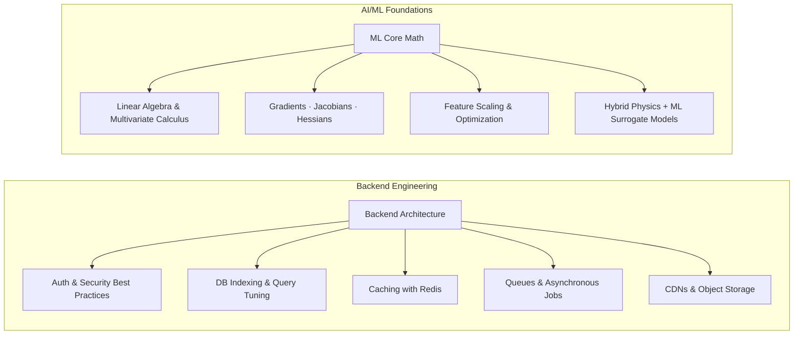

<div align="center">

<!-- Header Waving Banner -->


<!-- Dynamic Typing SVG Banner -->


<br/>

<!-- Visitor Counter & Status Badges -->

&nbsp;

&nbsp;

&nbsp;


<br/><br/>

<!-- Quick Navigation Badges -->
<a href="https://tanujexe.github.io/Portfolio/"></a>
&nbsp;
<a href="https://linkedin.com/in/tanuj-agrawal-19b609378/"></a>
&nbsp;
<a href="https://github.com/tanujexe"></a>
&nbsp;
<a href="mailto:tanujagrawal1432@gmail.com"></a>

</div>

<br/>

---

## ⚡ `whoami`

```bash
tanuj@developer:~$ cat profile.json
{
  "name": "Tanuj Agrawal",
  "education": "B.Tech Artificial Intelligence @ MITS Gwalior",
  "role": "Full Stack (MERN) Developer & AI/ML Integrator",
  "passions": ["Distributed Systems", "ML Math Fundamentals", "Product Engineering"],
  "philosophy": "Prefer shipping working products over reading docs in isolation."
}
```

I'm a developer who likes building **end-to-end products that actually run** — not just isolated tutorials or surface-level UI demos. Most of my time is split between architecting full-stack applications and embedding real, functional AI into them. 

At the same time, I'm strengthening the core mathematical foundation underneath AI/ML — **linear algebra, calculus, gradients, Jacobians, Hessians, and optimization algorithms** — ensuring ML is a transparent, predictable system rather than a black-box API.

<br/>

### 💡 Opinions I Hold Quietly

> - 🚢 **Shipping beats theory:** Building under constraints teaches what documentation leaves out.
> - 🧩 **AI is a layer, not a crutch:** AI features must serve a real product need, not just act as an API wrapper.
> - ⚡ **Database before UI:** Proper indexing, schema design, and query optimization save months of technical debt.
> - 📐 **Math makes ML controllable:** Knowing the gradients & linear algebra lets you debug models when standard tools fail.

<br/>

---

## 💻 Tech Stack & Tools

<div align="center">

### 🚀 Core & Full Stack Development


<br/><br/>

### 🧠 AI / ML & Data Science

<br/><br/>

&nbsp;

&nbsp;

&nbsp;


<br/><br/>

### 🛠️ Infrastructure, Tools & Utilities


</div>

<br/>

---

## 🎯 What I Build

<table width="100%">
<tr>
<td width="20%" align="center">🌐<br/><b>Full-Stack Web Apps</b><br/><sub>End-to-end, schema to interactive UI</sub></td>
<td width="20%" align="center">🤖<br/><b>AI-Powered Systems</b><br/><sub>Functional ML layers & predictive models</sub></td>
<td width="20%" align="center">🛠️<br/><b>Developer Tools</b><br/><sub>Sharp, focused CLI & backend utilities</sub></td>
<td width="20%" align="center">⚡<br/><b>Hackathon Builds</b><br/><sub>Rapid prototyping under tight constraints</sub></td>
<td width="20%" align="center">🚀<br/><b>SaaS Products</b><br/><sub>Real auth, real DBs, production deployment</sub></td>
</tr>
</table>

<br/>

---

## 🧠 Currently Building & Learning Roadmap



<br/>

---

## 🪁 Featured Projects

<table width="100%">
<tr>
<td width="50%" valign="top">

### 🪁 CreatoKite
**AI-Powered Creator-Brand Campaign OS**

An all-in-one platform connecting creators and brands through structured campaign workflows, PR opportunities, creator management, UGC pipelines, and automated collaboration tools.

- **Stack:** `React` `Node.js` `Express` `MongoDB` `AI Integrations`
- **Key Focus:** End-to-end workflow automation, smart brand matching, campaign analytics.

<br/>

[`💻 View Repository`](https://github.com/tanujexe) &nbsp;•&nbsp; [`🚀 Live Demo`](https://tanujexe.github.io/Portfolio/)

</td>
<td width="50%" valign="top">

### 🏔️ Passive Shelter Thermal Design Predictor
**Extreme-Climate Relief Shelter Thermal Simulation**

Predicts the thermal behavior of relief shelters in extreme Ladakh conditions using a hybrid physics + machine-learning surrogate model trained on ANSYS simulation datasets.

- **Stack:** `Python` `FastAPI` `XGBoost` `ANSYS Datasets` `NumPy`
- **Key Focus:** Fast thermal behavior estimation without computationally heavy CFD runs.

<br/>

[`💻 View Repository`](https://github.com/tanujexe) &nbsp;•&nbsp; [`🚀 Live Demo`](https://tanujexe.github.io/Portfolio/)

</td>
</tr>
</table>

<br/>

---

## 🏆 Hackathons & Competitive Coding

<div align="center">

| Event / Platform | Details & Focus | Status / Profile |
|---|---|---|
| 🇮🇳 **Smart India Hackathon 2026** | High-altitude relief shelter thermal prediction & design OS | *Active Competitor* |
| 🏫 **College & National Hackathons** | Rapid full-stack builds, AI-driven solutions under time constraints | *Frequent Participant* |
| 💻 **LeetCode** | Data Structures, Algorithms & Problem Solving | <a href="https://leetcode.com/"></a> |

</div>

<br/>

---

## 📊 GitHub Analytics & Activity

<div align="center">


&nbsp;&nbsp;


<br/><br/>


<br/><br/>


<br/><br/>

### 🕹️ Contribution Snake Animation


</div>

<br/>

---

## 💡 Daily Dev Motivation & Extras

<div align="center">


</div>

<br/>

<details>
<summary><b>🔍 Expand to see my setup & workflow preference</b></summary>

<br/>

- **OS:** Windows 11 with WSL2 (Ubuntu)
- **Editor:** VS Code with Tokyo Night / One Dark Pro theme & Fira Code Font
- **Terminal:** PowerShell & Bash with custom Git prompts
- **Coffee Intake:** ☕ Variable, directly proportional to bug complexity
- **Current Reading:** Deepening distributed systems patterns & database indexing strategies

</details>

<br/>

---

## 🤝 Let's Connect & Collaborate

<div align="center">

Got an interesting project, hackathon team opportunity, or full-stack/AI role? Let's talk!

<br/>

<a href="https://linkedin.com/in/tanuj-agrawal-19b609378/"></a>
&nbsp;
<a href="https://tanujexe.github.io/Portfolio/"></a>
&nbsp;
<a href="https://github.com/tanujexe"></a>
&nbsp;
<a href="mailto:tanujagrawal1432@gmail.com"></a>

<br/><br/>


<sub>*Code with passion, ship with purpose — building one commit at a time.*</sub>

</div>